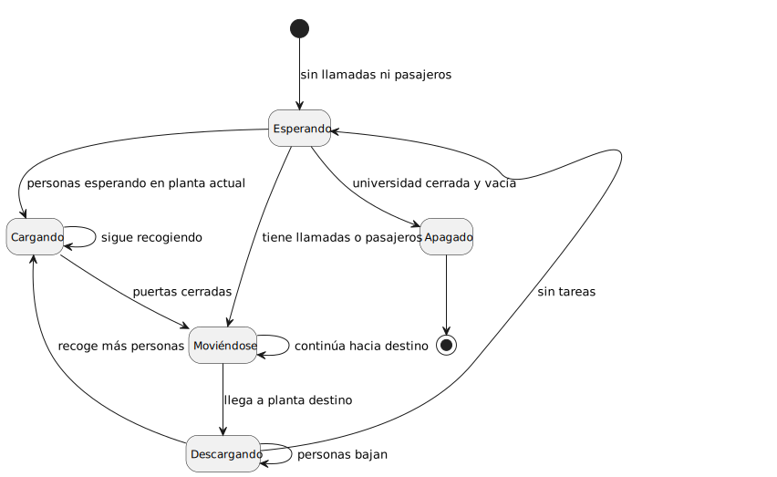

# Modelo de Dominio

## Diagrama de Clases 
| Diagrama | Código Fuente |
|----------|---------------|
| | [Ver código](modelosUML/MdD/DdC/DdC.puml) |

## Diagrama de Clases 1 Iteración
| Diagrama | Código Fuente |
|----------|---------------|
| | [Ver código](modelosUML/MdD/DdC/DdC_1Iteracion.puml) |

## Diagrama de Objetos 
| Diagrama | Código Fuente |
|----------|---------------|
| | [Ver código](modelosUML/MdD/DiagramaObjetos/DiagramaObjetos.puml) |

## Diagrama de Estados 

### Estado Ascensor
| Diagrama | Código Fuente |
|----------|---------------|
| | [Ver código](modelosUML/MdD/DiagramaEstados/DiagramaEstadosAscensor.puml) |

### Estado Persona
| Diagrama | Código Fuente |
|----------|---------------|
| | [Ver código](modelosUML/MdD/DiagramaEstados/DiagramaEstadosPersona.puml) |

### Estado Universidad
| Diagrama | Código Fuente |
|----------|---------------|
| | [Ver código](modelosUML/MdD/DiagramaEstados/DiagramaEstadosUniversidad.puml) |

