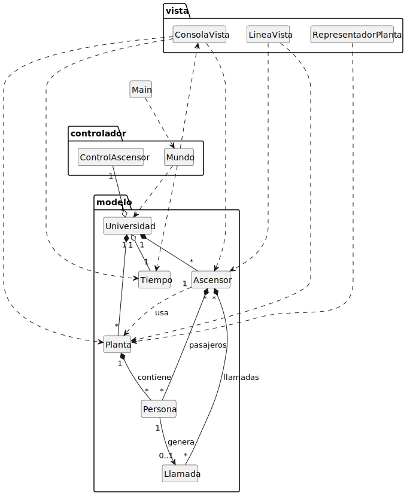
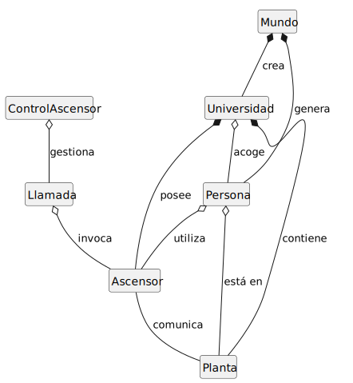
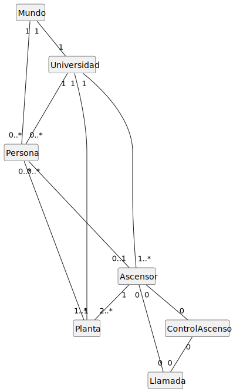
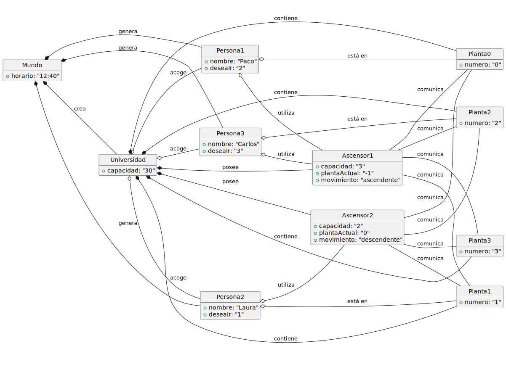

# Modelo de Dominio

## Diagrama de Clases 
| Diagrama | Código Fuente |
|----------|---------------|
| | [Ver código](modelosUML/MdD/DdC/DdC.puml) |

## Diagrama de Clases 1 Iteración
| Diagrama | Código Fuente |
|----------|---------------|
| | [Ver código](modelosUML/MdD/DdC/DdC_1Iteracion.puml) |

## Diagrama de Clases 2 Iteración
| Diagrama                                                   | Código Fuente                                          |
|------------------------------------------------------------|--------------------------------------------------------|
|  | [Ver código](modelosUML/MdD/DdC/DdC_2Iteracion_2.puml) |

| Diagrama                                                 | Código Fuente                                        |
|----------------------------------------------------------|------------------------------------------------------|
|  | [Ver código](modelosUML/MdD/DdC/DdC_2Iteracion.puml) |

## Diagrama de Objetos 
| Diagrama | Código Fuente |
|----------|---------------|
| | [Ver código](modelosUML/MdD/DdO/DdO.puml) |

## Diagrama de Estados 

### Estado Ascensor
| Diagrama | Código Fuente |
|----------|---------------|
| | [Ver código](modelosUML/MdD/DdE/DdE_Ascensor.puml) |

### Estado Persona
| Diagrama | Código Fuente |
|----------|---------------|
| | [Ver código](modelosUML/MdD/DdE/DdE_Persona.puml) |

### Estado Universidad
| Diagrama | Código Fuente |
|----------|---------------|
| | [Ver código](modelosUML/MdD/DdE/DdE_Universidad.puml) |

