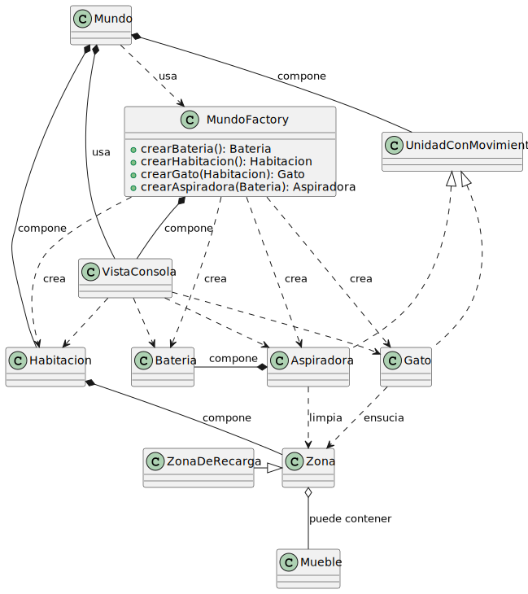
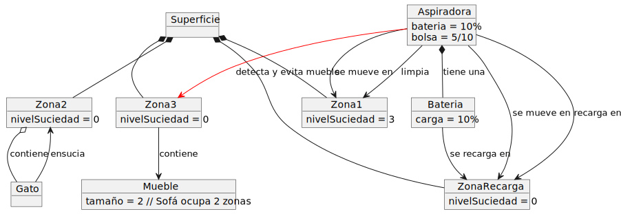
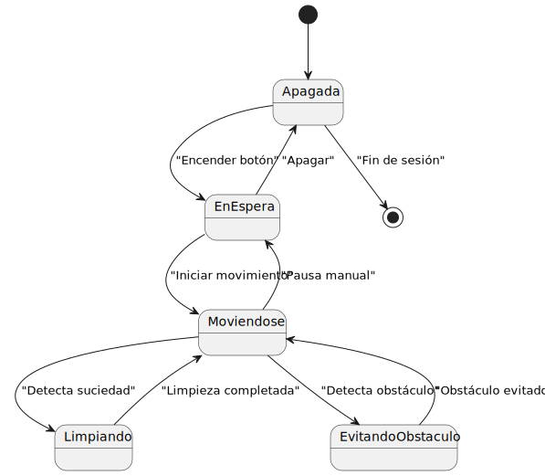
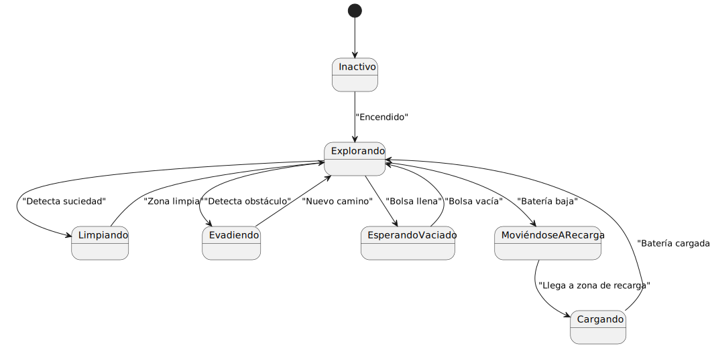
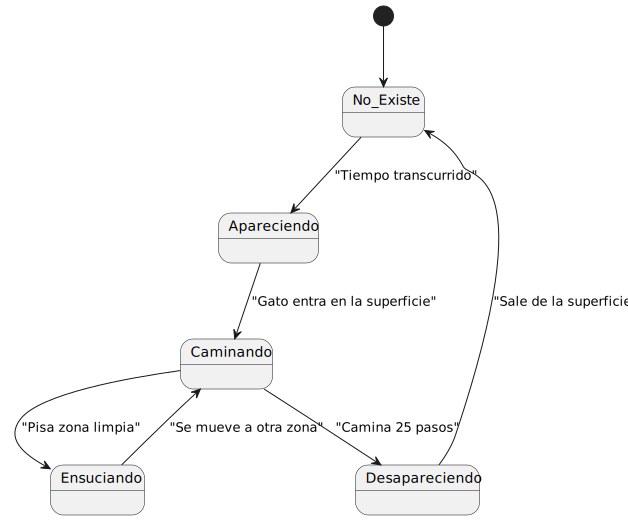
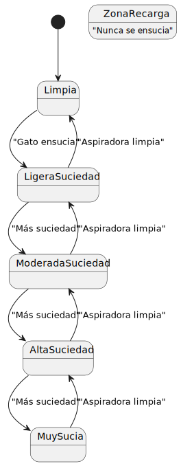
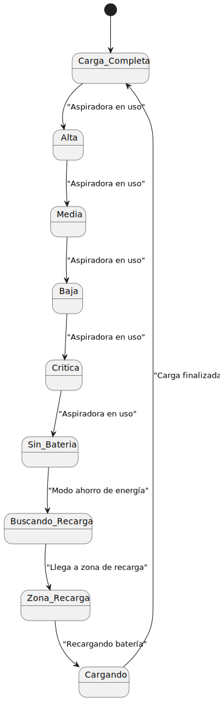

# Modelo del Dominio

## Diagramas de Clases

## Diagrama de Objetos

## Diagrama de Estados

### Diagrama de Estados - General

### Diagrama de Estados - Aspiradora

### Diagrama de Estados - Gato

### Diagrama de Estados - Zona

### Diagrama de Estados - Batería 

